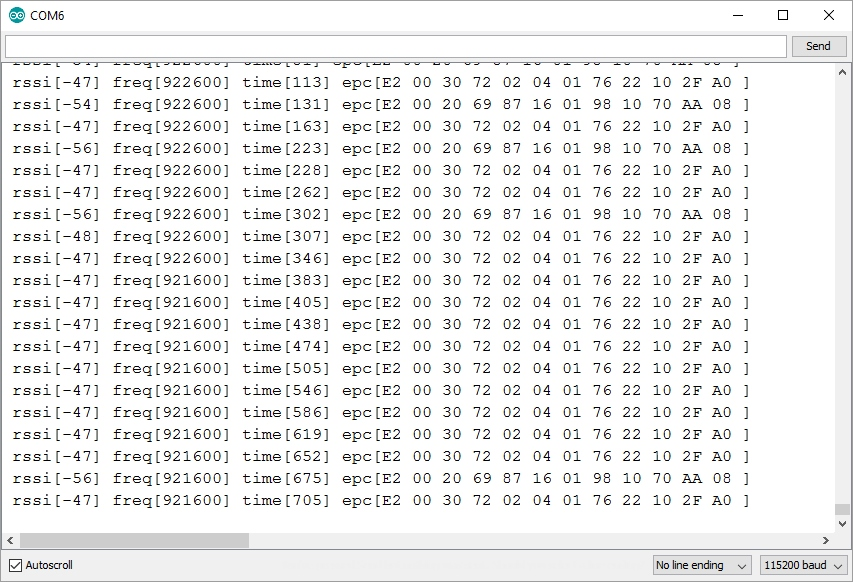
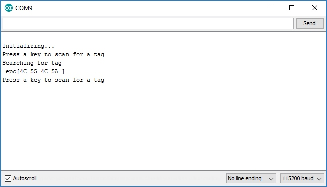
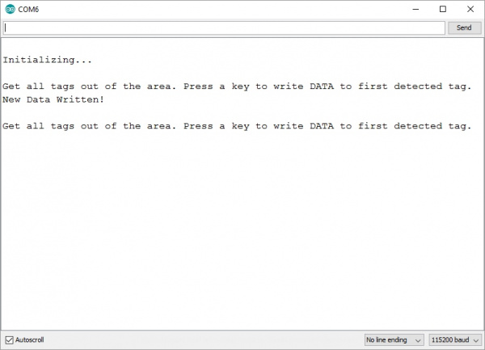
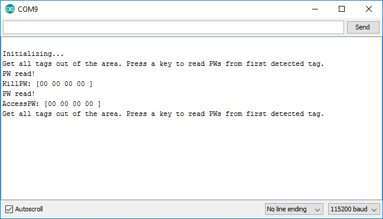
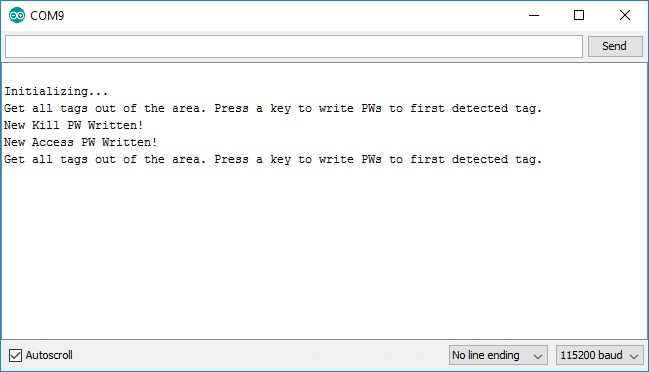
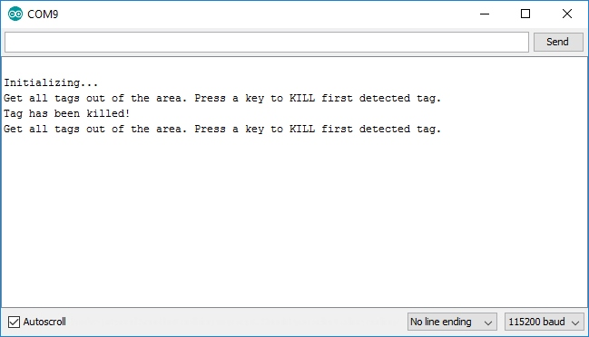

Let's take an in-depth look at most of the examples included in the SparkFun Simultaneous RFID Reader Arduino Library.

## UART Switch Position & Software Serial

Make sure the Serial Selection Switch is in the <b>"SER"</b> position when using this library. All of the examples in this Arduino library use the [Software Serial Library](https://docs.arduino.cc/learn/built-in-libraries/software-serial/) so if you are not using the SparkFun RedBoard IoT and following the assembly instructions in the Hardware Assembly section, make sure to connect the RX/TX pins on the SER header to compatible pins on your chosen development board. Note, this library 

## Code to Note

The latest version of the Simultaneous RFID Reader Library has a couple of settings to take note of and adjust accordingly depending on your hardware and setup.

### Serial Selection (Software vs Hardware)

If you're using a development board that supports [Software Serial](https://docs.arduino.cc/learn/built-in-libraries/software-serial/), uncomment the following lines and adjust the pins for RX/TX if necessary:

``` c++
#include <SoftwareSerial.h>
SoftwareSerial softSerial(2, 3); //RX, TX
```

The next option selects which type of serial is used. The code lists a couple of examples for both software serial and hardware so adjust the definition as needed. For example, if you're using a software serial library, define this as `softserial`. If you're using a hardware serial port on your development board, select the serial port (eg. Serial1) as shown below: 

``` c++
// #define rfidSerial softSerial // Software serial (eg. Arudino Uno or SparkFun RedBoard)
#define rfidSerial Serial1 // Hardware serial (eg. ESP32 or Teensy)
```

### Baud Rate Selection

Next, you'll want to define the baud rate for `rfidBaud`. We recommend using the settings shown below with 38400 when using software serial and 115200 when using hardware serial:

``` c++
// #define rfidBaud 38400
#define rfidBaud 115200
```

### Module Selection

Since this library supports both the M6E Nano and M7E Hecto, you'll need to define which module you are using. Adjust or comment/uncomment the `moduleType` definition to set it to the correct module:

``` c++
// #define moduleType ThingMagic_M6E_NANO
#define moduleType ThingMagic_M7E_HECTO
```

## Example 1 - Constant Read

The first example sets the M7E to constantly scan and report any tags it sees in the vicinity. Open the example by navigating to **File > Examples > SparkFun Simultaneous RFID Reader Library > Example 1 Constant Read**. Select your Board and Port and click the "Upload" button. Once the code finishes uploading, open the [serial monitor](https://learn.sparkfun.com/tutorials/terminal-basics/arduino-serial-monitor-windows-mac-linux) with the baud set to **115200**. 

??? "Example 1 - Constant Read"

    ```
	--8<-- "https://raw.githubusercontent.com/sparkfun/SparkFun_Simultaneous_RFID_Tag_Reader_Library/master/examples/Example1_Constant_Read/Example1_Constant_Read.ino"
	```

The code attempts to set up the module with the defined baud rate and if that fails, it prints "Module failed to respond. Please check wiring" If you see this prompt, double-check your connections to your development board and retry. On successful module startup and setup, the code prints "Press a key to begin scanning for tags." Send any key message and the M7E will begin to scan for any tags in range and print out their EPC as the screenshot below shows:

<figure markdown>
[{ width="600"}](./assets/img/Example1-Constant_Read.jpg "Click to expand")
</figure>

## Example 2 - Read EPC

The second example demonstrates how to perform a single-shot read of one tag in the reader's range and print out the EPC value over serial. This example uses the `.readTagEPC()` function to pass it an array of bytes (in almost all cases EPCs are 12 bytes), the size of the array (12), and the amount of time to scan before giving up (500ms is default). This returns **RESPONSE_SUCCESS** when the M7E detects a tag and stores the EPC in the array given.

??? "Example 2 - Read EPC"

    ```
    --8<-- "https://raw.githubusercontent.com/sparkfun/SparkFun_Simultaneous_RFID_Tag_Reader_Library/master/examples/Example2_Read_EPC/Example2_Read_EPC.ino"
    ```

<figure markdown>
[{ width="600"}](./assets/img/Example2-Read_Single.jpg "Click to enlarge")
</figure>

Note, this example also includes definitions and code to set up and use the buzzer found on the [Simultaneous RFID Reader - M6E Nano](https://www.sparkfun.com/products/14066) which is not present on the Simultaneous RFID Reader - M7E though users can wire a buzzer like [this](https://www.sparkfun.com/products/12567) for an audio feedback when a tag is scanned.

## Example 3 - Write EPC

Example 3 shows how to write a character string and store it as a custom EPC value. This is a great way to keep track of which tag is which by setting the EPC to something like `WRENCH` or `PILL#317`. Note, EPCs can only be written in an even number of bytes like the example sets it to:

??? "Example 3 - Write EPC"

    ```
    --8<-- "https://raw.githubusercontent.com/sparkfun/SparkFun_Simultaneous_RFID_Tag_Reader_Library/master/examples/Example3_Write_EPC/Example3_Write_EPC.ino"
    ```

``` c++
char stringEPC[] = "Hello!"; //You can only write even number of bytes
byte responseType = nano.writeTagEPC(stringEPC, sizeof(stringEPC) - 1); //The -1 shaves off the \0 found at the end of string
```
This example also introduces a new function `setWritePower()`. This sets the power level when writing to a tag similar to `setReadPower` so it can be boosted up to the same values as read power.

``` c++
nano.setWritePower(500); //5.00 dBm. Higher values may cause USB port to brown out
//Max Write TX Power is 27.00 dBm and may cause temperature-limit throttling
```

## Examples 4 & 5 - Read/Write User Data

Example 4 shows how to detect and read a tag's available user memory. Not all UHF RFID tags have user memory and may not be configurable.

??? "Example 4 - Read User Data"

    ```
    --8<-- "https://raw.githubusercontent.com/sparkfun/SparkFun_Simultaneous_RFID_Tag_Reader_Library/master/examples/Example4_Read_User_Data/Example4_Read_User_Data.ino"
    ```

Example 5 demonstrates how to edit a tag's user data through the `.writeUserData()` function. This function lets you pass an array of characters to the function and records it to the first tag detected by the reader. 

??? "Example 5 - Write User Data"

    ```
    --8<-- "https://raw.githubusercontent.com/sparkfun/SparkFun_Simultaneous_RFID_Tag_Reader_Library/master/examples/Example5_Write_User_Data/Example5_Write_User_Data.ino"
    ```

``` c++
char testData[] = "ACBD"; //Must be even number of bytes. "Hello" is recorded as "Hell".
byte responseType = nano.writeUserData(testData, sizeof(testData) - 1); //The -1 shaves off the \0 found at the end of string
```

<figure markdown>
[{ width="600"}](./assets/img/Example5-Writing_Data_to_Tag.jpg "Click to enlarge")
</figure>

A few bytes of editable memory may not sound like a lot be remember these are passive tags - no batteries required! You can query a tag for the user's dietary restrictions. Or you could adjust the lighting depending on who walked in the room. Or you could set the time at which a medication must be taken. Perhaps a prosthetic leg goes into a more aggressive mode when basketball shorts are worn. 

## Examples 6, 7, 8 - Passwords

The next three examples all deal with passwords to lock a tag with an Access Password or disable a tag with a Kill Password. 

**Example 6 - Read Passwords** displays the Access and Kill passwords for a tag detected by the reader. The Access password allows a user to lock a tag, preventing modification of various parts of the memory (EPC, User, etc). The Kill password is needed to disable a tag. Both passwords are `0x00000000` by default. 

??? "Example 6 - Read Passwords"

    ```
    --8<-- "https://raw.githubusercontent.com/sparkfun/SparkFun_Simultaneous_RFID_Tag_Reader_Library/master/examples/Example6_Read_Passwords/Example6_Read_Passwords.ino"
    ```

<figure markdown>
[{ width="600"}](./assets/img/Example6-Read_PWs.jpg "Click to enlarge")
</figure>

**Example 7 - Write Passwords** shows you how to write new passwords for both Access and Kill. 

??? "Example 7 - Write Passwords"

    ```
    --8<-- "https://raw.githubusercontent.com/sparkfun/SparkFun_Simultaneous_RFID_Tag_Reader_Library/master/examples/Example7_Write_Passwords/Example7_Write_Passwords.ino"
    ```

These values can be adjusted from the passwords set in the example by changing the following lines for myKillPW and myAccessPW:

``` c++
byte myKillPW[] = {0xEE, 0xFF, 0x11, 0x22};

byte myAccessPW[] = {0x12, 0x34, 0x56, 0x78};
```

<figure markdown>
[{ width="600"}](./assets/img/Example7-Write_PWs.jpg "Click to enlarge")
</figure>

After running Example 7, re-run Example 6 to see the updated passwords and ensure they are correct. It may seem odd that you can view the passwords. The Gen2 protocol has quite a few methods to lock out various portions of the memory preventing them from being read. Once the Access password is set the ability to read passwords, read user memory, and read portions of the EPC can all be controlled; this is called locking. Currently, locking is not supported in the Arduino library but it is available in the URA and in the Mercury API.

**Example 8 - Kill Tag** is an interesting example. It's pretty rare that you'll need to kill a tag but we find the concept fascinating and wanted to build in support for it.

??? warning - "Danger!"

    <b>Note:</b> Killing a tag blows an internal fuse to the IC and makes the tag irreversibly dead.

??? "Example 8 - Kill Tag"

    ```
    --8<-- "https://raw.githubusercontent.com/sparkfun/SparkFun_Simultaneous_RFID_Tag_Reader_Library/master/examples/Example8_Kill_Tag/Example8_Kill_Tag.ino"
    ```

It is very good to see that the protocol has the kill feature. Killing a tag makes sense after an item has been purchased (gallon of milk) or a process has been completed (dry cleaning has been picked up). By limiting the life-span of a tag you can help protect end user privacy and tracking.

The Gen2 protocol is well written and prevents a user from walking into a Wal-Mart and blasting away all the tags that haven't been configured. The default Kill password is all 0s but any tag will ignore the kill command with the password set to 0s. Therefore, you must first write a non-zero kill password (using Example7) then you must issue the kill command using the new password.

<figure markdown>
[{ width="600"}](./assets/img/Example8-Kill_Tag.jpg "Click to enlarge")
</figure>

If you're very paranoid about someone else using an UHF RFID reader/writer to reconfigure your tags consider writing new Access and Kill passwords to your tags then use the Universal Reader Assistant to lock the tags.