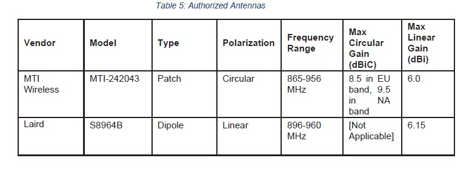
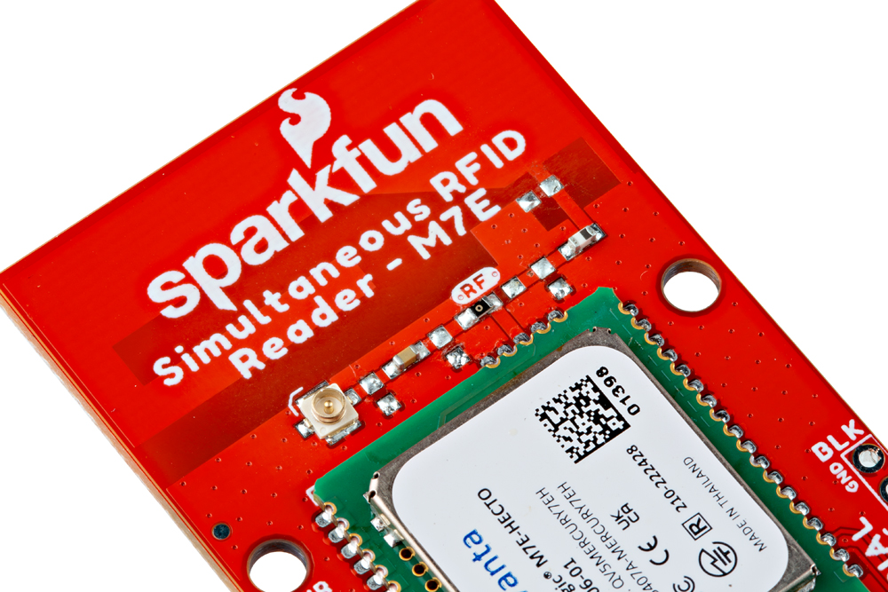
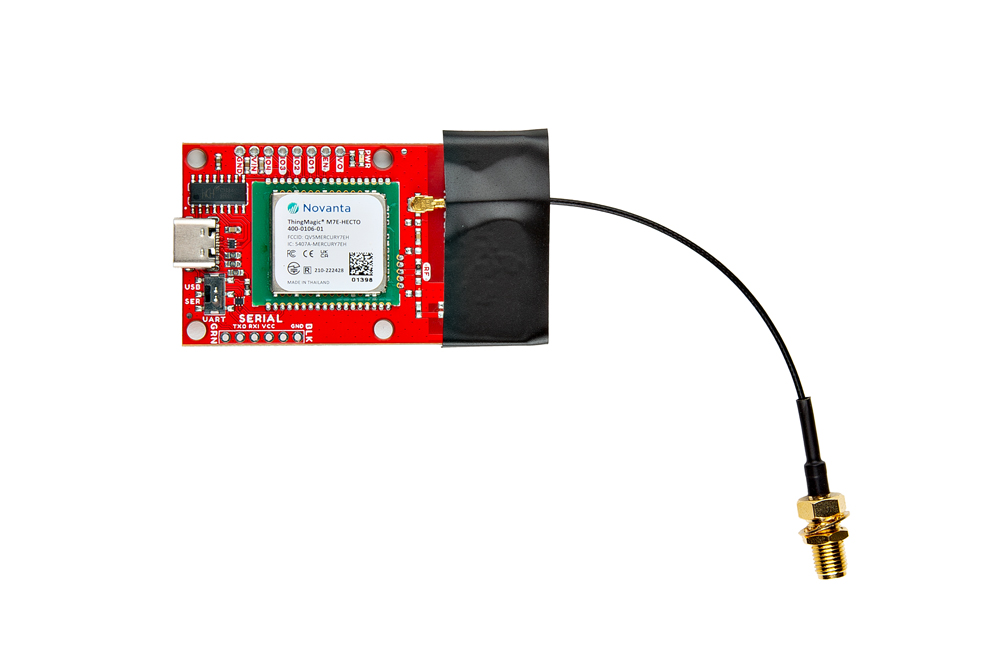
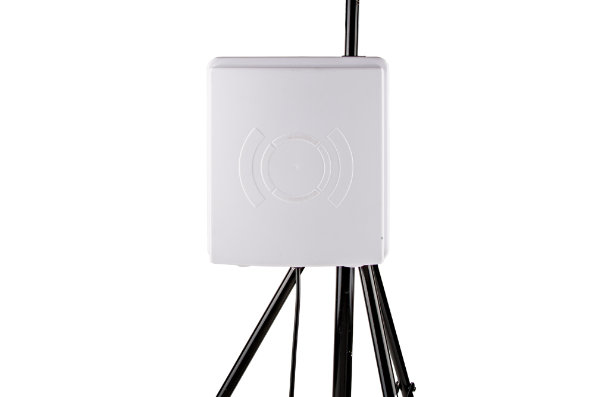
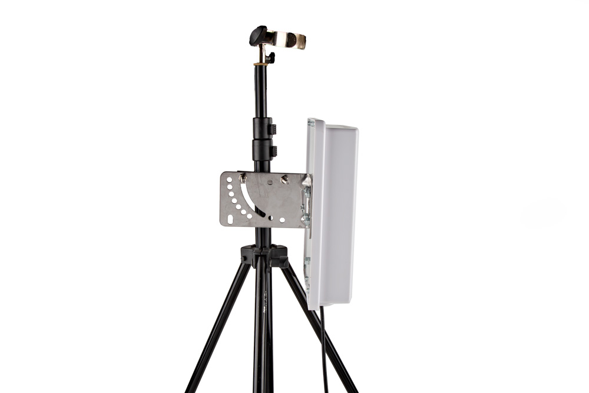
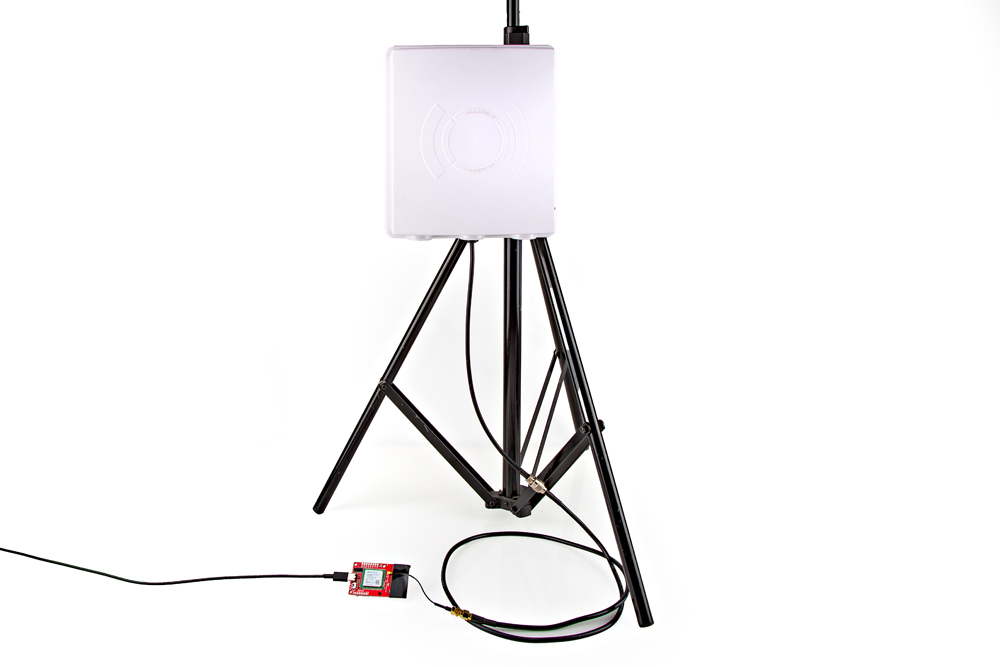

The integrated PCB antenna works well over short distances but users who want to get the maximum range for the M7E Hecto should consider using an external antenna. Connecting an external antenna to the Simultaneous RFID Reader - M7E requires some hardware adjustments, minor assembly steps and other considerations regarding the antenna. Let's go over these adjustments and considerations. 

## FCC Regulations

From section 5.8 of the [M7E Hecto User Guide](./assets/component_documentation/M7E_HECTO_User_Guide.pdf):

> No additional transmitter-compliance testing is required if the module is operated with the same type of antenna as listed in the FCC filing, as long as it has equal or lower gain than the antenna listed. Equivalent antennas must be of the same general type (e.g. dipole, circularly polarized patch, etc.), and must have similar in-band and out-of-band characteristics (consult specification sheet for cutoff frequencies).

The board's PCB trace antenna is a patch antenna with a much lower gain than the list of approved antennas which allows the use of an unmodified board in the field without additional FCC testing.

The **u.FL connector** allows users to connect higher-gain directional antennas. However, there are stipulations as to what external antennas can be used and **additional FCC certifications may be required**. 

!!! info
    <b>Note:</b> The onboard PCB antenna complies with the FCC regulation.

The list below from section 5.7 of the [M7E Hecto User Guide](./assets/component_documentation/M7E_HECTO_User_Guide.pdf) outlines antennas ThingMagic has tested and gotten approved by the FCC. You may use a different antenna from the ones in the list but it <b><i>must be of equal or less gain than an antenna previously authorized under the same FCC ID and must have similar in-band and out-of0band characteristics (consult specification sheet for cut-off frequencies)</i></b> if used in a product without additional testing.

<figure markdown>
[{ width="600"}](./assets/img/Authorized_Antennas.jpg "Click to enlarge")
<figcaption>*List of approved antenas*</figcaption>
</figure>

## Attaching the External Antenna

Switching to the external antenna connection requires changing the position of the antenna (labeled RF) resistor to route the M7E's antenna signal to the u.FL connector on the board.

!!! info "Adjusting from PCB Antenna to u.FL Connection"
<b>Note: </b> You do not need an external antenna for basic use of the Simultaneous RFID Reader - M7E but the PCB antenna reads tags reliably at only up to a few inches away at the highest read power and with the PCB antenna positioned away from any solid surfaces. If you want to take advantage of the full range, follow the steps below to modify the board and enable the u.FL connector for an external antenna connection. 

If you have never worked with surface mount components, we recommend reading through these tutorials:

-   <a href="https://learn.sparkfun.com/tutorials/how-to-use-a-hot-air-rework-station">
    <figure markdown>
    
    </figure>
    </a>
    <a href="https://learn.sparkfun.com/tutorials/how-to-use-a-hot-air-rework-station">**How to Use a Hot Air Rework Station**
    </a>

-   <a href="https://learn.sparkfun.com/tutorials/how-to-solder-through-hole-soldering#advanced_smd">
    <figure markdown>
    
    </figure>
    </a>
    <a href="https://learn.sparkfun.com/tutorials/how-to-solder-through-hole-soldering#advanced_smd">**How to Solder: Through-Hole Soldering - Advanced SMD**
    </a>

Carefully reflow the 0k&ohm; resistor labeled **RF** to move it to the u.FL position. You can either use a [soldering iron](https://www.sparkfun.com/products/23913) or [hot-air rework station](https://www.sparkfun.com/products/21253) to reflow the solder holding the resistor into place. The photo below shows the RF resistor after adjusting it to the u.FL position.

<figure markdown>
[{ width="600"}](./assets/img/Simultaneous_RFID_Reader_M7E-Antenna_Selection.jpg "Click to enlarge")
<figcaption>*Take careful note of the position of this resistor in the photo to make sure it is in the correct position.*</figcaption>
</figure>

Next, attach the u.FL to the [RP-SMA connector cable](https://www.sparkfun.com/products/662). Because this connector is fragile we recommend either taping or hot gluing the sheath of the cable to the PCB. This will help prevent damage to the u.FL connector in case the cable gets pulled on.

<figure markdown>
[{ width="600"}](./assets/img/Simultaneous_RFID_Reader_M7E-UFL.jpg "Click to enlarge")
</figure>

To get the best range we recommend attaching an external high-gain antenna to a tripod of some sort. If you only have a desk, that's ok too.

<figure markdown>
[{ width="600"}](./assets/img/Simultaneous_RFID_Reader_M7E-Antenna_Mounted.jpg "Click to enlarge")
</figure>

We used the included hardware with the antenna to attach it to the leg of the tripod. 

<figure markdown>
[{ width="600"}](./assets/img/Simultaneous_RFID_Reader_M7E-Mount.jpg "Click to enlarge")
</figure>

Now connect the RP-SMA to RP-TNC cable. And finally, connect the RP-TNC to the external antenna. You can use a different UHF RFID antenna but you will need to have the correct connectors and cables to go from the u.FL connector on the board to the connector on your specific antenna.

<figure markdown>
[{ width="600"}](./assets/img/Simultaneous_RFID_Reader_M7E-Full_External_Antenna.jpg "Click to enlarge")
</figure>

-> *u.FL connector to RP-SMA to RP-TNC* <-

!!! warning

    <b>Don't Forget!</b> Ensure that personnel do not stand in the radiation beam of the antenna unless they are more than 21cm away from the face of the antenna (to adhere to FCC limits for long-term exposure). Refer to the <a href="https://cdn.sparkfun.com/assets/learn_tutorials/6/1/3/Nano_Design_Guide_rev01E.pdf">M7E Nano design guide</a> for more information.
