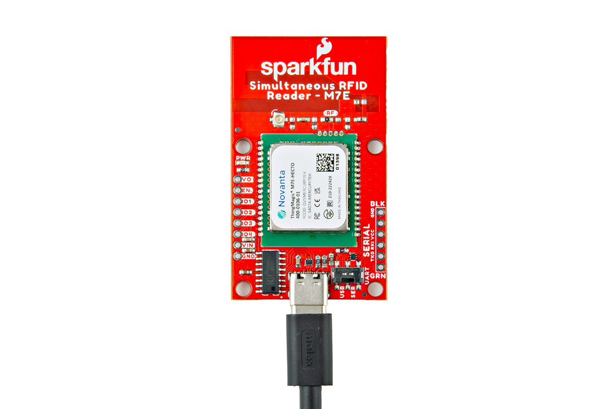
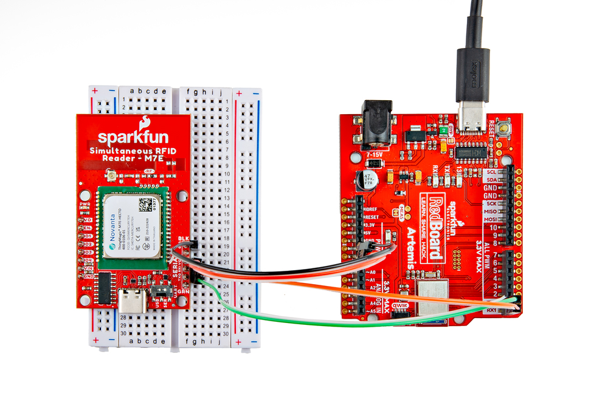

In this section we'll cover the two ways to set up the Simultaneous RFID Reader - M7E over both USB-C and connected to a microcontroller for use with the SparkFun Simultaneous RFID Reader Arduino Library. 

## Communicating via USB-C Serial

The fastest and easiest way to start using the board is through the USB-C connector. Simply plug the board into a computer with a USB-C cable and open up the Universal Reader Assistant.

<figure markdown>
[{ width="600"}](./assets/img/Simultaneous_RFID_Reader_M7E-USB_Connection.jpg "Click to enlarge")
</figure>

Reminder, many computer USB ports can only supply <b>~500mA @5V</b> which limits the power level settings to roughly 20dBm and lower. Running the M7E at higher power levels may require a dedicated power supply.

## Communicating via Serial PTH Header

Users who prefer to communicate with the RFID reader using the Serial PTH header should solder either wires or header pins to connect them to a <b>3.3V</b> microcontroller (you can also use this to connect to a USB UART board like the [Serial Basic](https://www.sparkfun.com/products/15096). If you are not familiar with through-hole soldering or would like a refresher, take a read through [this tutorial](https://learn.sparkfun.com/tutorials/how-to-solder-through-hole-soldering).

<figure markdown>
[{ width="600"}](./assets/img/Simultaneous_RFID_Reader_M7E-Arduino_Circuit.jpg "Click to enlarge")
</figure>

We'll demonstrate soldering male headers to the board and use jumper wires to connect the RFID Reader to the [SparkFun RedBoard Artemis](https://www.sparkfun.com/products/15444) for use with the [SparkFun Simultaneous RFID Tag Reader Arduino Library](https://github.com/sparkfun/SparkFun_Simultaneous_RFID_Tag_Reader_Library).

<table>
    <tr>
        <th>RFID Reader</th>
        <th>RedBoard Artemis</th>
    </tr>
    <tr>
        <td>RX</td>
        <td>TX / D2</td>
    </tr>
    <tr>
        <td>TX</td>
        <td>RX / D3</td>
    </tr>
    <tr>
        <td>VIN</td>
        <td>5V</td>
    </tr>
    <tr>
        <td>Ground</td>
        <td>Ground</td>
    </tr>
</table>

!!! note "Digital Pin Selections"

    Digital pin values are the default selections for Software Serial in the [Simulataneous RFID Reader Arduino Library](https://github.com/sparkfun/SparkFun_Simultaneous_RFID_Tag_Reader_Library) and may be incompatible with your selected microcontroller. Refer to the [Arduino Software Serial Reference](https://docs.arduino.cc/learn/built-in-libraries/software-serial#limitations-of-this-library) for pin limitations for common microcontrollers.

### Power Supply Considerations

When connecting the Simultaneous RFID Reader - M7E to a microcontroller, make sure your power supply can source sufficient current for your selected power level as the board can draw up to <b>720mA @5V</b> at max read power level. The M7E's internal voltage regulator includes built-in protection that engages when the current draw reaches <b>1A</b> and will not allow any more supply current to the module. As such, it is strongly recommended to use a <b>5V</b> power supply when setting the read power to above +26 dBm.

If you opt to power the RFID Reader from your development board's output voltage we recommend using the <b>5V</b> out (if applicable) and then powering your development board through a dedicated power supply to avoid browning the circuit out as USB ports can only source <b>~500mA@5V</b>. The image below shows the Simultaneous RFID Reader - M7E connected to the RedBoard IoT and powered with a dedicated power supply through the barrel jack.
