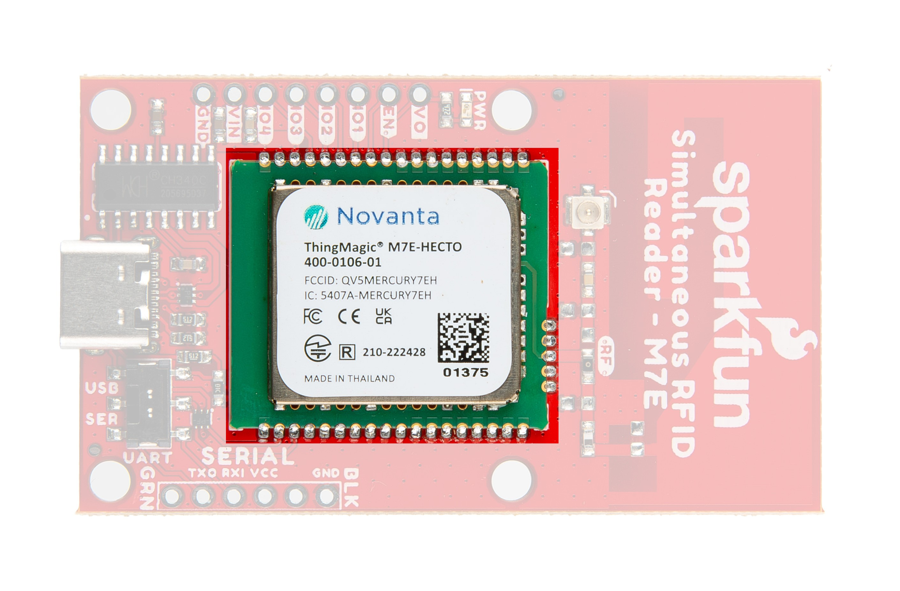
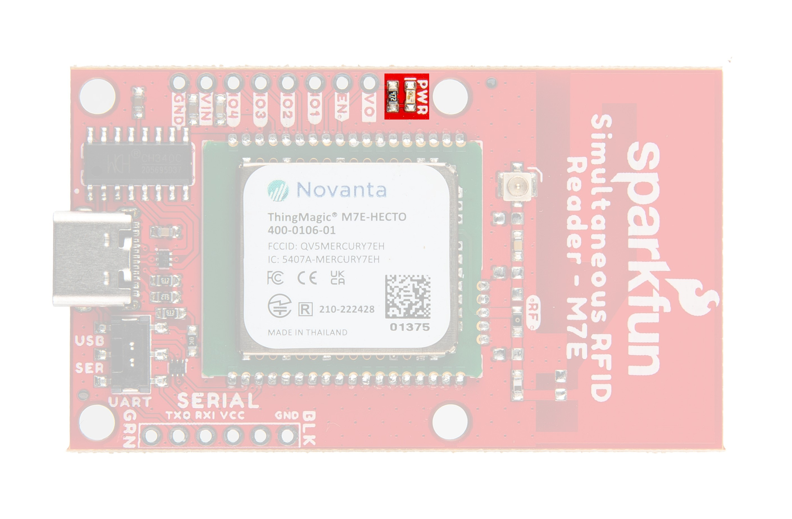

In this section we'll take a closer look at the hardware present on the Simultaneous RFID Reader 3.3V.

## M7E Hecto UHF RFID Reader

The M7E Hecto is an Ultra-High Frequency (UHF) RFID reader capable of reading multiple tags simultaneously at up to 150 tags per second. 

<figure markdown>
[{ width="600"}](./assets/img/Simultaneous-RFID_Reader_M7E-Module.jpg "Click to enlarge")
</figure>

The module can also write data quickly to RFID tags with 96-bit EPC (80msec typical write time). The M7E Hecto boasts adjustable read and write RF power levels from 0dBm to 27dBm in 0.01dBm steps and can read tags from several feet away (even more than 16 feet in our testing!) with the proper antenna, conditions and device settings. The M7E-Hecto works with common, low-cost, passive, Gen2 UHF tags available from a variety of online vendors in a variety of shapes and sizes. We offer two types of UHF tags, ones [with adhesive](https://www.sparkfun.com/products/20228) backing and [ultra-small](https://www.sparkfun.com/products/16464) ones. Both have 64 bytes of user-writable memory.

The M7E accepts a supply voltage between <b>3.3V</b> and <b>5.5V</b> and operates normally so long as the module's current draw is below <b>1A</b> as it includes a built-in protection circuit that allows no more than <b>1A</b> drawn to prevent damage to the M7E. Therefore, it's recommended to power the M7E with a 5V source to avoid hitting the current limit at higher read/write powers or when the GPIO and Vout lines are supplying current to other devices. Refer to section 5.2 of the [M7E User Guide](./assets/component_documentation/M7E_HECTO_User_Guide.pdf) for detailed information on this limit as well as graphs showing typical current draw at various supply voltages as well as power requirements for different power settings.

## Communication Interfaces

The board has two options for interacting with the M7E Hecto's serial interface: USB-C and a plated through-hole (PTH) header. The PTH header can connect to a microcontroller or serial converter (running at <b>3.3V</b> logic or properly level-shifted). The selection switch on the board labeled <b>UART</b> allows users to choose between the two serial interface options. The board also breaks out several of the M7E Hecto's GPIO pins and the Enable pin.

<figure markdown>
[{ width="600"}](./assets/img/Simultaneous-RFID-Reader_M7E-Comms.jpg "Click to enlarge")
</figure>

### USB-C

The USB-C connector on the board allows for quick use of the M7E Hecto with just a USB-C cable. The board uses a CH340C USB-to-Serial adapter to translate between the M7E's UART and the USB-C connection. 

    <b>Heads Up!</b> With RF power level set to 27dBm the board can draw over <b>700mA (3.6W @ 5V)</b>. Most USB ports on computers only source up to ~500mA so the board may start to brown out at power settings over 22dBm when powered from a USB port. Users who wish to set the over 22dBm should make sure their power source (either from USB-C via a power adapter or through a regulated <b>5V</b> supply to the VIN PTH pin) can source enough current to power the board. We recommend a power adapter like <a href="https://www.sparkfun.com/products/15448">this</a>.

### Through-Hole Serial Connection

The board includes a PTH header for serial communication with a 3.3V microcontroller or other device. The header matches the pinout for our [Serial Breakouts](https://www.sparkfun.com/products/15096) for easy connection to those devices.

### Serial Selection Switch

The two-way switch on the board labled <b>UART</b> allows the user to toggle between the two serial interfaces: USB-C (<b>USB</b>) and the Serial Header (<b>SER</b>).

### Enable and GPIO PTHs

The M7E uses an internal DC to DC converter to provide itself with power. When the <b>EN</b> (enable) pin is pulled low the DC/DC converter is turned off and the module does a hard reset. <b>EN</b> can be left unconnected for normal operation. 

!!! warning
    <b>Note:</b> The <b>3.3V</b> pin on this header is not intended as a power source. It connects to the <b>V_OUT</b> pin on the M7E Hecto which can only supply <b>5mA</b>. It is best used as a voltage reference.

## Power LED

The lone LED on the board indicates device power status. Users can disable this LED by severing the <b>PWR</b> jumper. The Power LED receives voltage from the <b>VOUT</b> pin on the M7E Hecto. Driving the <b>EN</b> pin low disables <b>VOUT</b> and can be used to turn this LED off.

<figure markdown>
[{ width="600"}](./assets/img/Simultaneous_RFID_Reader_M7E-LED.jpg "Click to enlarge")
</figure>

## Solder Jumpers

The board has three solder jumpers labeled: <b>PWR</b>, <b>VIN SEL</b>, and <b>SHLD</b>. The table below outlines their label, function, default state, and any notes regarding their use.

<figure markdown>
[{ width="600"}](./assets/img/Simultaneous_RFID_Reader_M7E-Jumpers.jpg "Click to enlarge")
</figure>

<table>
    <tr>
        <th>Label</th>
        <th>Default State</th>
        <th>Function</th>
        <th>Notes</th>
    </tr>
    <tr>
        <td>PWR</td>
        <td>CLOSED</td>
        <td>Completes Power LED circuit.</td>
        <td>Open to disable Power LED.</td>
    </tr>
    <tr>
        <td>VIN SEL</td>
        <td>CLOSED</td>
        <td>Nets V_USB, VIN, and VCC together.</td>
        <td>Three-way jumper that nets all voltage inputs together. Adjust to isolate any of these voltages from the others (or all three) if needed.</td>
    </tr>
    <tr>
        <td>SHLD</td>
        <td>CLOSED</td>
        <td>Ties USB Shield pin to PCB ground plane.</td>
        <td>Open to isolate the USB Shield pin from the rest of the board.</td>
    </tr>
</table>

## Ground Plane Heatsink

The board has a large ground plane heatsink on the bottom to help dissipate heat generated by the module.

<figure markdown>
[{ width="600"}](./assets/img/Simultaneous_RFID_Reader_M7E-Heat_Sink.jpg "Click to enlarge")
</figure>

The exposed copper pour allows the connection to a heatsink such as a chassis or block of metal if needed. The M7E has an integrated temperature sensor that will monitor the internal temperature and can disable RF if the module is overheating and keeps it off until the recorded temperature drops back into the safe range (-40&deg;C to +60&deg;C). Attaching a heat sink to the exposed copper pour or adjusting the read power and/or duty cycle can help dissipate heat to prevent this throttling in long-period applications of this board. Refer to the [thermal management considerations](../thermal_management) of this guide or section 5.4 of the [M7E User Guide](./assets/component_documentation/M7E_HECTO_User_Guide.pdf) for more information.

## Antenna Options

The Hecto M7E is a powerful transmitter capable of outputting up to 27dBm! That's a lot. The board comes with a PCB trace antenna and a u.FL connector for an external antenna connection.

<figure markdown>
[{ width="600"}](./assets/img/Simultaneous_RFID_Reader_M7E-Antenna.jpg)
</figure>

The trace antenna is enabled by default. Adjust the <b>RF</b> resistor to switch the antenna signal to the u.FL connector to use an external antenna. Refer to the [Using an External Antenna](../external_antenna) section of this guide for more information on this assembly step.

## Board Dimensions

The board measures 2.40" x 1.40" (60.96mm x 35.56mm) and has four mounting holes that fit a [4-40](https://www.sparkfun.com/products/10453) screw.

<figure markdown>
[{ width="600"}](./assets/board_files/SparkFun_Simultaneous_RFID_Reader_M7E-Dimensions.png "Click to enlarge")
</figure>