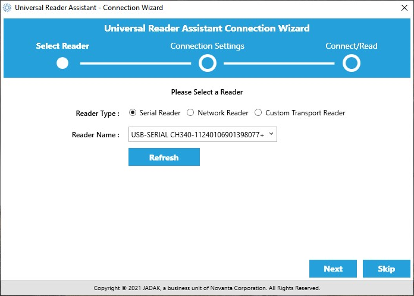
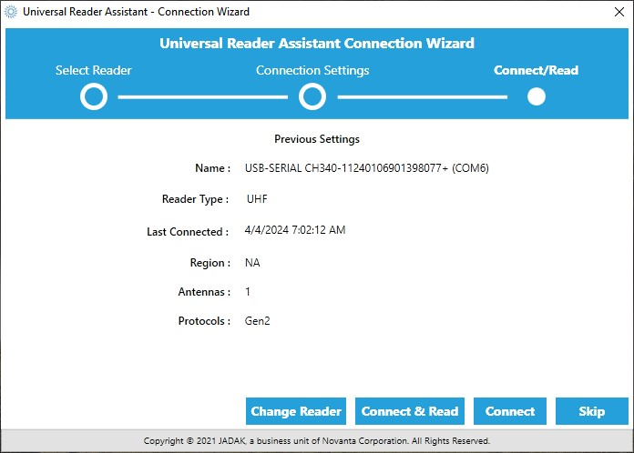

The Universal Reader Assistant is a great way to start taking advantage of the full capabilities of the M7E-NANO. Unfortunately, it's only available for Windows.

## Download & Install

Start by downloading the Universal Reader Assistant (URA). 32-bit and 64-bit versions are available.

[Universal Reader Assistant Download](https://www.jadaktech.com/product/thingmagic-universal-reader-assistant/){ .md-button .md-button--primary }

Open the installer once downloading finishes and follow the installation wizard instructions.

## Universal Reader Assistant

Make sure the Simultaneous RFID Reader is plugged in either over USB or the Serial Header to a USB-to-Serial converter and open the Universal Reader Assistant. You should be greeted by the Connection Wizard menu to select the reader type and port:

<figure markdown>
[{ width="600}](./assets/img/URA-Port_Selection.jpg "Click to enlarge")
</figure>

You can skip this selection and move on to the main menu of the Universal Reader Assistant. Otherwise, select the port your Simultaneous RFID Reader is on and click "Next" and the Connection Wizard should show you the RFID reader settings:

<figure markdown>
[{ width="600"}](./assets/img/URA-M7E_Selected.jpg "Click to enlarge")
</figure>

Click either "Connect & Read" or "Connect" to open up the Universal Reader Assistant.

Expand the *Connect* menu and select `Serial Reader` and drop down the menu to select your COM port. Click `Connect`. The module will be pinged over the serial connection to verify its existence. 

Next, select your `Region`. Since we are in North America, we've selected **NA2**.

<b>Note:</b> The ‘Transport Logging’ checkbox is very handy. Select this box and all the serial communication will be recorded to a log file. These HEX bytes can be deciphered and recreated using an Arduino or other microcontroller if you need a particular capability or feature that is not supported in the SparkFun Simultaneous RFID Reader Arduino library.

Next open the `Read/Write Options` and click on **1** under *Antennas*. 

Finally, open the `Reader Power Settings` tab and select your Read Power. Tune this setting down to 5dBm. If you want to power the board from USB then use a power setting below 5dBm. 27dBm is ok to use only if you have external power (more than one USB port can provide). See the [Power Supply Considerations](https://learn.sparkfun.com/tutorials/simultaneous-rfid-reader-33v-hookup-guide/hardware-assembly) in the Hardware Assembly section for more information.

Now we’re ready to read! Click on the `Read` button at the top. Bring some RFID tags near the reader and you'll see them appear.

There are a ton of features to the Nano from ThingMagic. Poke around the Universal Reader Assistant to learn more. *Write EPC* and *User Memory* are two of the most commonly used tabs.

**Thermal Throttling:** If you see this window pop up it means the module is reporting a temperature-limit fault condition.

The module has an internal temperature sensor and will protect itself from permanent damage. You’ll need to lower your read power or add heatsinking. See the previous section of this guide, [Thermal Considerations](https://learn.sparkfun.com/tutorials/simultaneous-rfid-reader-33v-hookup-guide/thermal-management-considerations), for more information.